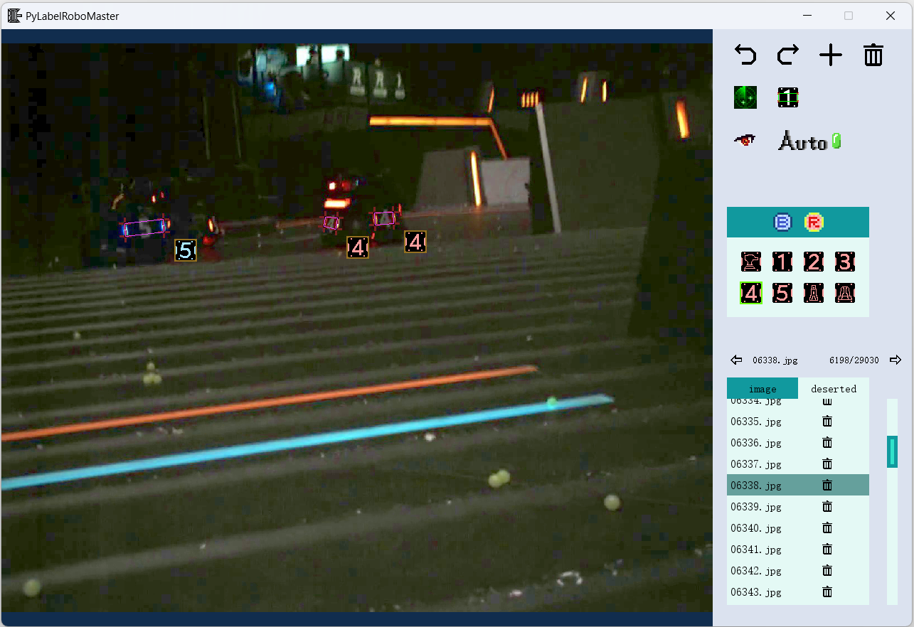
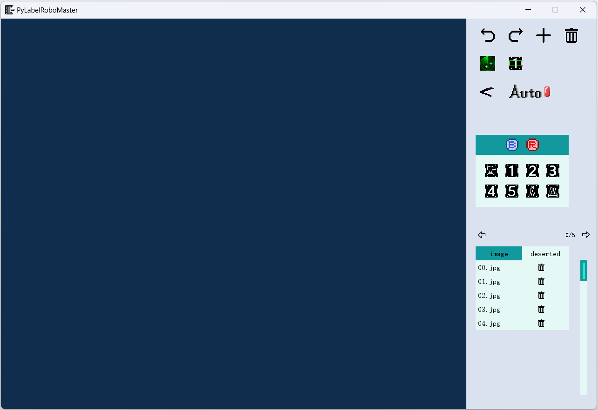
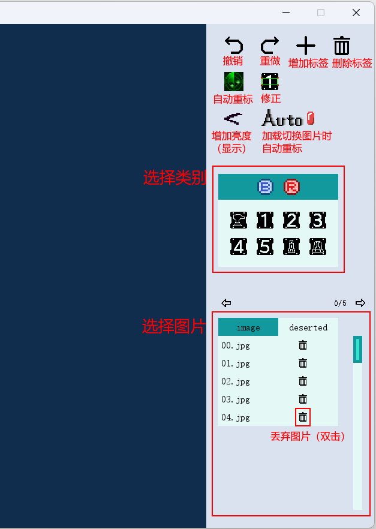

# PyLabelRoboMaster



PyLabelRoboMaster 是一个基于 Pygame 开发的 Robomaster 智能数据集标注工具。支持用户标注装甲板灯条的 4 个顶点、颜色以及类别，用于训练自瞄识别网络。


## 1 安装和运行

**环境**

需要 `python >= 3.7` 版本，第三方库：

- pygame >= 2.5.0
- numpy >= 1.2
- opencv >= 4.9.0

可以使用 pip 完成第三方库的安装

```bash
pip install pygame
pip install numpy
pip install opencv-python
```


如果启用了自动重标功能，需要配置[Yolov8环境](https://docs.ultralytics.com/quickstart/)


**运行方式**

在直接运行 `start.py` 文件，可以通过命令行：

```bash
python start.py
```

如果你是第一次运行，并且没有修改过任何配置，那么将默认打开测试数据集，如下图：



如果想要打开自己的数据集，则需要在[配置](#2.1 配置)中导入。


## 2 使用说明

### 2.1 配置

打开 `config/config.json` 文件

```json
{
    "image_folder": "./resources/test_dataset/images",
    "label_folder": "./resources/test_dataset/labels",
    "deserted_image_folder": null,
    "mode": "armor",
    "load_network": false,
    "model_path": "",
    "resolution": [1280, 720]
}
```

- `image_folder` 和 `label_folder` 分别为图片文件夹和标签文件夹，修改后重新运行程序即可完成数据集加载
- `deserted_image_folder`：丢弃图片文件夹，如果为 `null`，则默认为`{image_folder}\deserted` 路径
- `mode`：标注模式，默认为装甲板模式
- `load_network`：是否加载网络，即是否启用自动重标功能
- `model_path`：神经网络模型路径
- `resolution`：窗口分辨率


### 2.2 数据集格式

数据集采用 Yolo 格式，即一张图片对应一个 txt 文件（例如有 `images/001.jpg`，就有 `labels/001.txt` 与之对应）。

txt 文件中每一行代表一个目标，如果一个文件有多行，则说明对应图片内有多个目标。一行共计 13 个数字，以空格分割。从左到右依次为：

- 装甲板类别 id（整数）
- 外接矩形 x, y, width, height
- 左上 x, y
- 左下 x, y
- 右下 x, y
- 右上 x, y

说明：

- 外接矩形的 x, y, width, height 和顶点的 x, y 为归一化的数值，即 *像素尺寸 / 图片尺寸*，大小在 $[0, 1]$ 之间

- 外接矩形的 x, y 表示的是矩形中心的坐标，而**不是**左上角坐标

- | 类别(id) | 哨兵  | 英雄  | 工程   | 3号步兵 | 4号步兵 | 5号步兵 | 前哨站 | 基地   |
  | -------- | ----- | ----- | ------ | ------- | ------- | ------- | ------ | ------ |
  | **蓝色** | BG(0) | B1(1) | B2(2)  | B3(3)   | B4(4)   | B5(5)   | BO(6)  | BB(7)  |
  | **红色** | RG(8) | R1(9) | R2(10) | R3(11)  | R4(12)  | R5(13)  | RO(14) | RB(15) |


### 2.3 操作说明

#### 2.3.1 工具栏



工具栏具体说明：

- **撤销**：撤销上一次对标签的修改
- **重做**：与撤销相反
- **增加标签**：点击后进入*正在标注状态*，鼠标点击装甲板 4 个灯条顶点后生成标签（点击顺序任意，会自动按左上、左下、右下、右上排序），可以按 esc 键退*正在标注状态*
- **删除标签**：删除选中的标签
- **自动重标**：使用神经网络推理进行标注
- **修正**：在选中的标签附近进行轮廓查找和匹配，匹配成功后将标注点移动至轮廓端点
- **增加亮度**：打开以后图片显示亮度增加，标注低曝光数据集时对人眼更加友好
- **自动重标开关**：打开后，每进行图片切换操作都会自动重标（对重标结果不满意可以撤销到重标前的状态）
- **类别选择**：点击后将选中标签批量修改为选中类别，增加标签时新建的标签类别为上一次选中的类别
- **图片选择**：如果对图片质量不满意，双击*丢弃图片按钮*可以将图片丢弃，丢弃后的图片默认移动至图片文件夹下的 `deserted` 文件夹，可以在 deserted 栏中双击*找回按钮*，找回丢弃的图片


#### 2.3.2 按键与快捷键

- **选择标签**
  - 左键点击标签或其图标：单选
  - 点击空白处：取消选择所有
  - crtl+左键：多选，再点一次取消选择
  - ctrl+a：全选
- **修改标签**：
  - 鼠标悬浮于顶点处，按住左键可以拖动顶点
  - 按住鼠标中键可以拖动选中标签

- **图片缩放和平移**：
  - 鼠标滚轮缩放图片
  - 按住鼠标右键拖动图片


| 快捷键              | 功能                                       |
| ------------------- | ------------------------------------------ |
| **a**               | 添加标签                                   |
| **d** 或 **delete** | 删除选中标签                               |
| **q**               | 上一张图片                                 |
| **e**               | 下一张图片                                 |
| **f**               | 自动重标                                   |
| **c**               | 修正选中的装甲板                           |
| **r**               | 将选中装甲板改为红色                       |
| **b**               | 将选中装甲板改为蓝色                       |
| **0-7**             | 修改选中装甲板类型                         |
| **esc**             | 取消选中的标签（点击空白处也可以取消选中） |
| **ctrl+a**          | 全选标签                                   |
| **ctrl+z**          | 撤销                                       |
| **ctrl+y**          | 重做                                       |
| **ctrl+s**          | 保存（切换图片或退出时会自动保存）         |
| **ctrl+f**          | 加载图片时自动重标，再按一次关闭           |


### 2.4 自定义接口

为了实现更多的扩展功能，适应不同格式的数据集，代码中提供了可以自定义的接口，以供修改使用。


#### 2.4.1 标签文件IO

`src/process/label_io.py` 文件提供了标签文件的加载和保存函数

```python
def loadLabel(path: str) -> List[LabelInputOutput]:
    '''
    当切换图片的时候会被调用，传入的路径是标签文件路径，例如 labels/001.txt
    需要返回标准输入输出 List[LabelInputOutput]
    '''

def saveLabel(path: str, labels: List[LabelInputOutput]) -> None:
    '''
    当需要保存时会被调用，传入需要保存的路径 path 和标准输入输出 List[LabelInputOutput]
    '''
```


#### 2.4.2 自动重标

`src/process/correct.py` 文件提供自动重标的接口

```python
def relabel(img: cv2.Mat, original_labels: List[LabelInputOutput]) -> List[LabelInputOutput]:
    '''
    传入图片 img 进行重标，以及图片原有的标注点 original_labels 提供参考
    理论上重标不依赖原有的标注点，因为我们不知道原有的标注点是否可靠
    original_labels 只是在不启用该功能时原封不动将其返回
    '''
```


#### 2.4.3 修正

`src/process/correct.py` 文件提供标注修正的接口

```python
def correctLabels(img: cv2.Mat, labels: List[LabelInputOutput]) -> List[LabelInputOutput]:
    '''
    该函数的意图是：用户认为原有的标注点已经大致准确，需要通过轮廓提取进行更高精度的修正
    原则上返回值和输入值要大致相同
    '''
```


## 3 贡献指南

本项目仍有许多需要完善之处，欢迎各位开源爱好者或 rmer 参与本项目的进一步完善。


### 3.1 贡献流程

1. 提交 Issue

   - 明确、具体描述你遇到的问题，包括重现步骤、预期行为和实际行为，如果可能，附加屏幕截图。

   - 也可以提出改进建议，并说明改进原因。

2. 提交 Pull Request

   - 使用清晰的标题描述 Pull Request 的目的

   - 详细说明你的更改

   - 确保代码符合项目的编码标准和风格


### 3.2 贡献内容

本项目希望在实现 [【RM2023-数据集标注工具开源】哈尔滨工业大学（深圳）](https://github.com/MonthMoonBird/LabelRoboMaster) 的基础上扩展一些额外的功能，以及实现更加简便的 UI 交互操作。

目前尚未实现的功能有：

- 风车数据标注
- 显示蒙版线条
- 重叠标签的检查和提醒
- 自适应窗口大小