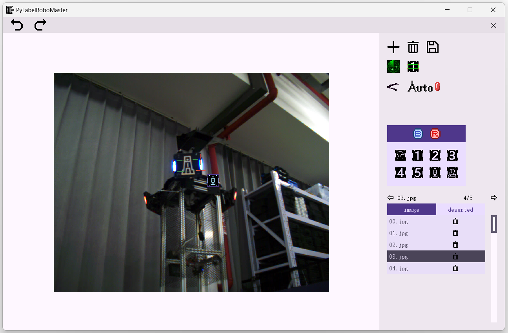

# PyLabelRoboMaster



PyLabelRoboMaster 是一个 Robomaster 数据集标注软件，用于训练自瞄识别网络。支持

- 24赛季前的装甲板灯条 4 点标注
- 25赛季装甲板灯条 4 点标注（不含5号装甲板）


## 1 环境和运行

### 1.1 环境

需要 `python == 3.9` 版本，第三方库：

- numpy >= 1.2
- opencv >= 4.9.0

可以使用 pip 完成第三方库的安装

```bash
pip install numpy
pip install opencv-python
```


### 1.2 运行方式

**源代码运行**

运行 `start.py` 文件，可以通过命令：

```bash
python start.py
```


## 2 使用说明

[User Guide](./docs/UserGuide.md)


## 3 感谢

感谢其它学校的开源给本软件提供参考：

- 哈尔滨工业大学开源： [【RM2023-数据集标注工具开源】哈尔滨工业大学（深圳）](https://github.com/MonthMoonBird/LabelRoboMaster) 
- 上海交通大学开源： [LabelRoboMaster: RoboMaster智能数据集标注工具](https://github.com/xinyang-go/LabelRoboMaster)


## 4 开源许可

PyLabelRoboMaster 软件完全免费，采用 [MIT](https://opensource.org/license/MIT) 开源协议。
