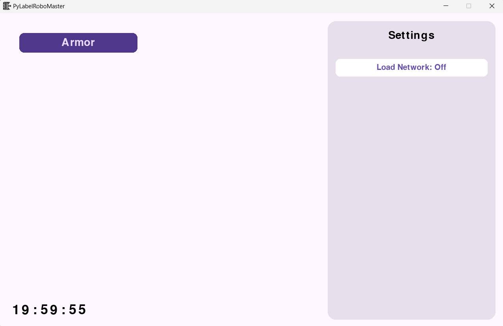
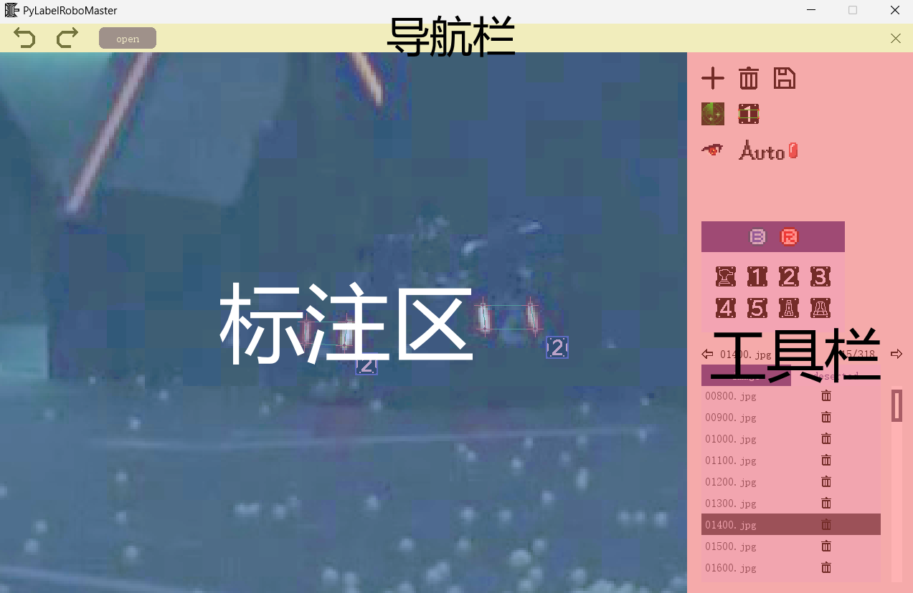
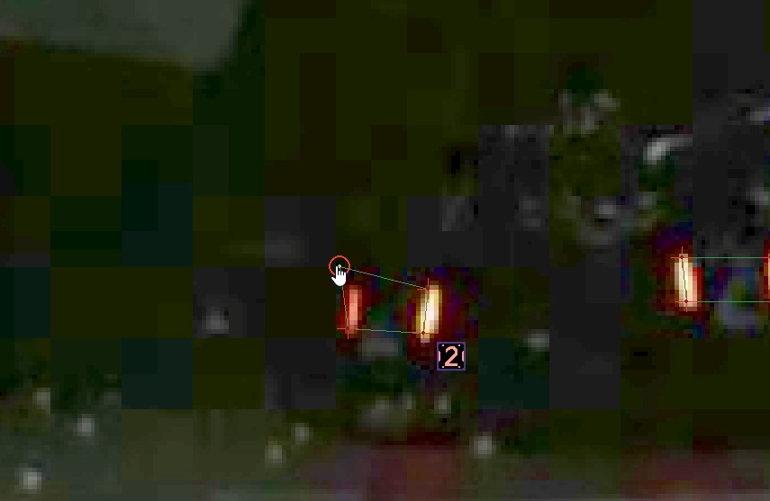
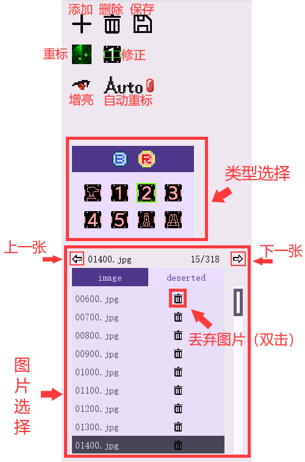
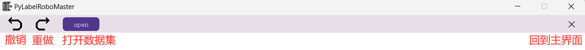
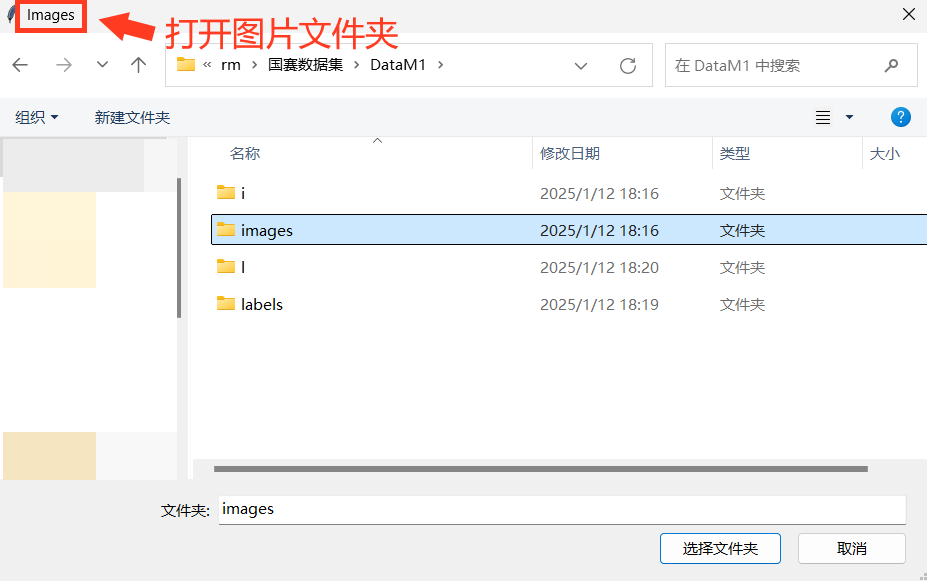
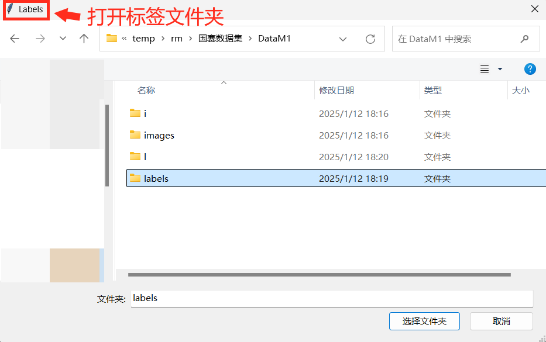

# 用户指南

## 1 主界面

启动程序以后，进入主界面（现在还空荡荡的）

- 点击左侧 "Armor" 按钮，进入装甲板标注界面
- 点击右侧 "Load Network" 开关，可以选择是否启用自动标注功能（加载神经网络可能需要一点时间）

## 2 装甲板标注界面

标注界面分为 3 部分：标注区、导航栏和工具栏

### 2.1 标注区

鼠标滚轮：缩放图片

鼠标右键：拖动图片

鼠标左键：拖动标注的顶点

点击线框内部或图标可以选中标签，已选中的标签高亮并加粗显示（左边为选中，右边为未选中）

ctrl+左键 多选，ctrl+a 全选

### 2.2 工具栏

按钮功能说明：

- **增加**：点击增加标注按钮以后，进入*正在标注状态*，在标注区依次点击 4 点后生成标签（点击顺序任意，会自动按左上、左下、右下、右上排序），可以按 esc 键退出*正在标注状态*
- **删除**：删除选中的标签
- **保存**：保存当前标注进度（切换图片或程序退出时都会自动保存）
- **重标**：使用神经网络对整张图重新标注（通常会覆盖原有标签）
- **修正**：使用传统视觉算法，对选中的标签进行修正
- **增亮**：增加图片亮度，遇到低曝光数据集时可以打开
- **自动重标**：打开后，每当切换图片时都会重标

类型选择说明：

- 类型（class）由两部分组成：颜色（color）和类别（type），例如R2，BG等
- 当点击颜色（color）或类别（type）时，所有选中的标签都会变为对应类型（class）

图片选择说明：

- 如果对当前图片不满意（如图片太模糊，或出现了已经被取消的兵种），可以双击丢弃图片按钮，丢弃的图片会进入 deserted 部分
- 如果想还原丢弃的图片，进入 deserted 部分，双击还原按钮，即可还原被丢弃的图片

### 2.3 导航栏

按钮功能说明：

- **撤销**：撤销上一次对标签的改动

- **重做**：撤回上一次撤销

- **打开数据集**：点击后依次选择**图片文件夹**、**标签文件夹**，即可打开数据集

  

  

- **回到主界面**

### 2.4 数据集导入

数据集采用 Yolo 格式，即一张图片对应一个 txt 文件（例如有 `images/001.jpg`，就有 `labels/001.txt` 与之对应）。

txt 文件中每一行代表一个目标，如果一个文件有多行，则说明对应图片内有多个目标。一行共计 13 个数字，以空格分割。从左到右依次为：

- 装甲板类别 id（整数）
- 外接矩形 x, y, width, height
- 左上 x, y
- 左下 x, y
- 右下 x, y
- 右上 x, y

说明：

- 外接矩形的 x, y, width, height 和顶点的 x, y 为归一化的数值，即 *像素尺寸 / 图片尺寸*，大小在 $[0, 1]$ 之间

- 外接矩形的 x, y 表示的是矩形中心的坐标，而**不是**左上角坐标

- | 类别(id) | 哨兵  | 英雄  | 工程   | 3号步兵 | 4号步兵 | 5号步兵 | 前哨站 | 基地   |
  | -------- | ----- | ----- | ------ | ------- | ------- | ------- | ------ | ------ |
  | **蓝色** | BG(0) | B1(1) | B2(2)  | B3(3)   | B4(4)   | B5(5)   | BO(6)  | BB(7)  |
  | **红色** | RG(8) | R1(9) | R2(10) | R3(11)  | R4(12)  | R5(13)  | RO(14) | RB(15) |

### 2.5 快捷键一览

#### 2.5.1 键盘快捷键

| 快捷键              | 功能                                 |
| ------------------- | ------------------------------------ |
| **a**               | 添加标签                             |
| **d** 或 **delete** | 删除选中标签                         |
| **q**               | 上一张图片                           |
| **e**               | 下一张图片                           |
| **f**               | 自动重标                             |
| **c**               | 修正选中的装甲板                     |
| **r**               | 将选中的装甲板改为红色               |
| **b**               | 将选中的装甲板改为蓝色               |
| **0-7**             | 修改选中的装甲板类别（type）         |
| **esc**             | 取消选中的标签（点击空白处效果相同） |
| **ctrl+a**          | 全选标签                             |
| **ctrl+z**          | 撤销                                 |
| **ctrl+y**          | 重做                                 |
| **ctrl+s**          | 保存（切换图片或退出时会自动保存）   |
| **ctrl+f**          | 开关自动重标                         |

#### 2.5.2 鼠标快捷键

左键：

- 按住左键：拖动顶点
- 左键点击标签或图标：单选
- 点击空白处：取消选中标签
- crtl+左键：多选

中键：

- 滚动滚轮：缩放图片
- 按住中键：拖动选中标签（同时拖动 4 个顶点）

右键：

- 按住右键：拖动图片

## 3 视频检验界面

该功能用于检验网络的识别效果，用户导入视频和模型文件后，程序支持实时对视频进行推理，并对推理结果进行缓存。支持图片和结果的导出。

### 3.1 工具栏

工具栏支持视频导入、模型权重导入、导出路径选择、图片和标签导出、实时推理。

### 3.2 视频播放器

视频播放器支持视频的播放、暂停、倍速播放、进度拖动、逐帧播放功能，支持显示推理标签。
